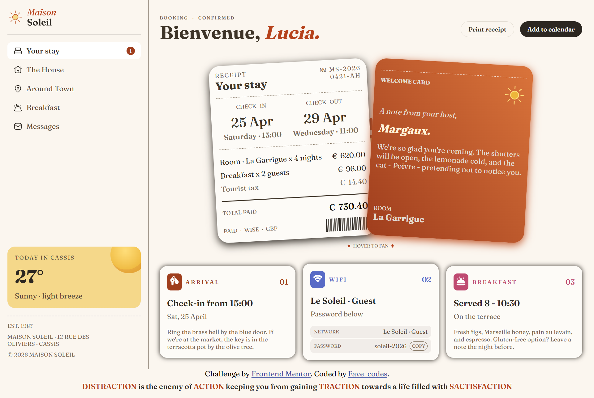

# Frontend Mentor - Hotel booking confirmation page solution

This is a solution to the [Hotel booking confirmation page challenge on Frontend Mentor](https://www.frontendmentor.io/challenges/hotel-booking-confirmation-page). Frontend Mentor challenges help you improve your coding skills by building realistic projects.

## Table of contents

- [Overview](#overview)
  - [The challenge](#the-challenge)
  - [Screenshot](#screenshot)
  - [Links](#links)
- [My process](#my-process)
  - [Built with](#built-with)
  - [What I learned](#what-i-learned)
  - [AI Collaboration](#ai-collaboration)
- [Author](#author)
- [Acknowledgments](#acknowledgments)

**Note: Delete this note and update the table of contents based on what sections you keep.**

## Overview

### The challenge

Users should be able to:

- View the optimal layout for the interface depending on their device's screen size
- See hover and focus states for all interactive elements on the page
- Open and close the navigation menu on smaller screens (optional JavaScript)
- Copy the Wi-Fi password to their clipboard using the copy button (optional JavaScript)

### Screenshot



### Links

- Solution URL: [Add solution URL here](https://github.com/Fave-code2/hotel-booking/tree/main)
- Live Site URL: [Add live site URL here](https://your-live-site-url.com)

## My process

### Built with

- Semantic HTML5 markup
- CSS custom properties
- Flexbox
- CSS Grid
- JavaScript

### What I learned

I learnt how to copy text to clipboard

```js
copyBtn.addEventListener("click", () => {
  navigator.clipboard.writeText(textToCopy.textContent).then(() => {
    copyBtn.textContent = "Copied!";
    setTimeout(() => {
      copyBtn.textContent = "Copy";
    }, 2000);
  });
});
```

### AI Collaboration

Used claude to get how to copy text to clipboard

## Author

- Frontend Mentor - [@yourusername](https://www.frontendmentor.io/profile/yourusername)
- Twitter - [@thefavestyle](https://x.com/thefavestyle)
- Instagram - [@fave_codes](https://www.instagram.com/fave_codes?igsh=cDdmZmZleDlwcHNp&utm_source=qr)

## Acknowledgments

Dedicated to claude for making sure young dev practice their skills not just head knowledge.
